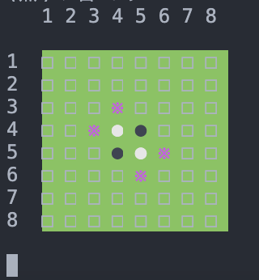

# 「（1人で遊べる）VSオセロ」CUI
プレイヤー先行で1人でオセロができるC言語で書かれたCUIプログラムです．

<h1>遊び方</h1>

- プレイヤーは先手です．

- 駒を置くときは，対戦マスにの上左に振ってある数字を見て，横のマス目→縦のマス目の順に間隔を開けずに入力する．
  - 例）　左から3，上から2のますにコマを置きたいときは，"32"　と入力（""内を入力）
 
- 置くことが可能なますには，* で示されている．

<h1>敵AIアルゴリズム</h1>

- 終盤で用いる深さ優先探索と，序盤で用いるマスに振られた評価値と盤面からコマの配置から評価値を算出する2つのパターンを切り替えて計算しています．

- 深さ優先探索では最終盤面まで読み切り，"必ず負けない手"を打ちます．
  - ただし，計算量の問題から残り20マス残っている状態から，深さ優先探索に切り替わります．
  - 147行目のint変数rest_massの値を変えることでAIのレベルを調節できます．
  - rest_mass=20の時，出力までにおおよそ10秒前後かかる可能性があります．（もし，レベルを調節する際は，値を大きくすると計算が終わらないので，20以下の数字を適用させてください．デフォルトで20に設定しています）
  
